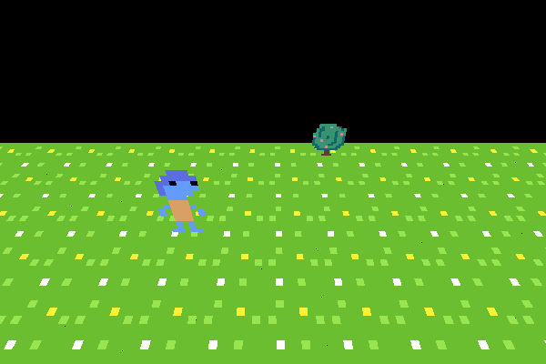

# Zubway Engine
    
A game engine focused on simplicity and performance


# Project Structure

### App folder
Source files for a game im currently working on, or a demo.
basically a sandbox to test new features for the engine.

### ZubwayEngine folder
Engine source files

### Lua build system
Something new im trying out, CBA with CMake and Premake so im making
Dobuild as a side side project.
```
# on linux
USAGE:
  build.lua <all|wingfx|app|shaders>
```

# Dependancies

### General
- Vulkan 1.0
  - debug layer
- Lua 5.4
- glslc

### Operating system
- linux
  - GCC
  - xcb
  - vulkan-xcb

- everything else
  - unsupported

# Whats in the app folder?

Im making a game called "Stones to Bridges". It will be a game inpired by spore and crusader kinds 3.

You will be able to lead your tribe from humble beginnings in the stone age, to rule
your map with any rhetoric you want !!

Scope is still being planned up

