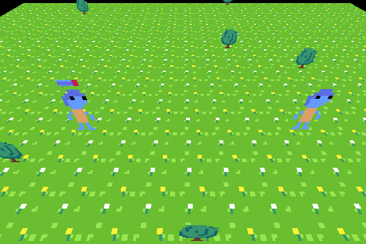

# Zubway Engine
    
A game engine focused on simplicity and performance


# Project Structure

### App folder
Source files for a game im currently working on, or a demo.
basically a sandbox to test new features for the engine.

### ZubwayEngine folder
Engine source files

### Lua build system
Something new im trying out, CBA with CMake and Premake so im making
Dobuild as a side side project.

```sh
# on linux
USAGE:
  lua build.lua <all|wingfx|logix|gfx|app|shaders|run> # order matters !! 'run' should almost always be last

  all:     build all available targets
  wingfx:  build all window and vulkan related files
  logix:   build all general ZE abstractions
  gfx:     build all ZE graphical abstractions
  app:     build your app
  shaders: build your shaders

  run:     run your app

  example:
    lua build.lua app shaders run # this rebuilds the app and shaders, then runs the updated app
```

# Dependancies

### General
- Vulkan 1.0
  - debug layer
- Lua 5.4
- glslc

### Operating system
- linux
  - GCC
  - xcb
  - vulkan-xcb

- everything else
  - unsupported

# Whats in the app folder?

Im making a game called "Stones to Bridges". It will be a game mainly inpired by spore and crusader kinds 3.

Guide your civilisation from the stone age to a sophisticated society.
Starting with basic resources and a small tribe, you will be able to discover new cultural and technological
innovations to shape the world as you see fit.
Will you be merciful, cruel, or just a passive observer?

Scope is still being planned up

